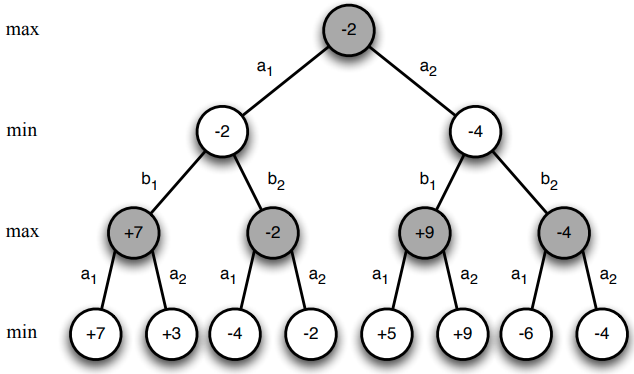
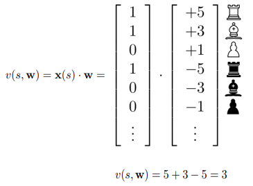

# Lecture 10 · Classic games case study

These are the notes taken during the RL Course by David Silver. In this case, the class watched was not the one from the 2015 course, but the guest lecture given by David Silver at the 2018 UCL Deep and Reinforcement Learning course (also on YouTube).

[TOC]

## Why games?

Games are a simple test bed to test AI agents and capture some of the real world's complexity.

They have been thoroughly studied.

RL algorithms have lately achieved Superhuman levels of performance in several games, like Chess, Checkers, Othello, Go...

## Game theory

In game theory we study the optimal policy for i-th player $\pi^i$ if all other players fix their policies $\pi^{-i}$.

The __best response__ $\pi_*^i(\pi^{-i})$ is optimal policy against those policies.

__Nash equilibrium__ is a joint policy for all players such that every player’s policy is a best response. In this situation __no player would choose to deviate__ from Nash.
$$
\pi^i=\pi_*^i(\pi^{-i}), \; \forall i
$$

### Single-agent and self-play RL

__Best response__ is solution to single-agent RL problem, where we fix the other players' policies and they become part of the environment. In this situation, the game is reduced to an MDP and the best response is the optimal policy for this MDP.

__Nash equilibrium__ is fixed-point of self-play RL. Each agent learns best response to other players until they all reach a fixed point (Nash equilibrium).

### Two-player zero-sum games

We will focus on a special class of games:

* A __two-player__ game has two (alternating) players
* A __zero-sum__ game has equal and opposite rewards for black and white

We will start considering __perfect information__ games, where the game is fully observed.

To find Nash equilibria in these games we use:

* Game tree search
* Self-play RL
* Combinations of the previous two

## Minimax

A __value function__ defines the expected total reward given joint policies $\pi=\left< \pi^1, \pi^2 \right>$.
$$
v_\pi(s)=\mathbb E_\pi[G_t|S_t=s]
$$
A __minimax value function__ maximizes white’s expected return while minimizing black’s expected return:
$$
v_*(s) = \max_{\pi^1} \min_{\pi^2} v_\pi(s)
$$
A __minimax policy__ is a joint policy $\pi=\left< \pi^1, \pi^2 \right>$ that achieves the minimax values

There is a unique minimax value function.

A minimax policy is a Nash equilibrium.

### Minimax search

Minimax values can be found by depth-first game-tree search.

#### Value function approximation

In most situations it's impractical to search to the end of the game.

We can instead use value function approximator $v(s,\mathbf w) \simeq v_*(s)$

Use value function to estimate minimax value at leaf nodes

Minimax search run to fixed depth with respect to leaf values

##### Binary-linear value function

The most common way in which value function approximators are built.

In the example of chess:

* Binary feature vector $\mathbf x(s)$: e.g. one feature per piece
* Weight vector $\mathbf w$: e.g. value of each piece
* Position is evaluated by summing weights of active features

This approach was used in Deep Blue for chess and Chinook for checkers.

## Self-Play Temporal-Difference Learning

We can apply value-based RL algorithms to games of self-play.

We can use either MC, TD(0) or TD($\lambda$) to update the value function approximator's parameters, as studied along the course.

### Policy improvement with afterstates

For deterministic games it is sufficient to estimate the state-value function, because we can efficiently evaluate the __afterstate__:
$$
q_*(s,a)=v_*(\textrm{succ}(s,a))
$$

### Self-Play TD in Backgammon

Consisting on a small MLP on top of some features from the Backgammon board.

Initialised with random weights

Trained by games of self-play

Using non-linear temporal-difference learning

Greedy policy improvement (no exploration)

Algorithm always converged in practice

Once this result wad obtained, the same idea was applied to several other games. It did not work out well, possibly because of exploration issues.

## Simulation-based search

Self-play reinforcement learning can replace search.

The main idea is to simulate games of self-play from root state $S_t$ and use them to plan the next steps.

One way to do this is by using MC Tree Search.

The most effective variant is UCT algorithm (Balance exploration/exploitation in each node using UCB).

Self-play UCT converges on minimax values

### Simple MC search in Scrabble (Maven)

The moves were evaluated as `score + v(rack)`, so a value function was learned from experience that estimated the value of the letters in the rack.

A basic version of MC search resulted in a strong enough program to beat a world champion. The main outline of the technique was:

* Roll-out moves by imagining n steps of self-play
* Evaluate resulting position by `score + v(rack)`
* Score move by average evaluation in roll-outs

### AlphaGo

#### Learning

There are 2 neural networks:

* The __policy__ network: evaluates the board and tells which positions to play.
* The __value__ network: studies the board and tells which player is more likely to win the game.

The original AlphaGo used supervised learning from real human experience to train the policy network.

Then RL was used to refine the policy network and build the value network.

#### Search

The search tree in Go is huge. Some techniques were put to use to reduce the search space.

* The __breadth__ of the tree is reduced using the policy network. Only the most relevant directions are explored.
* The __depth__ of the tree is reduced by simulating a finite number of steps and estimating the final outcome using the value network.

The MC tree search algorithm was slightly modified to calculate some Q values for the actions and to add an UCB to encourage exploration.

### AlphaGo Zero

The idea was to build AlphaGo from scratch, without the usage of human knowledge at all.

It only used one neural network and the tree search algorithm was refined to make it simpler. Another core idea was that giving it human knowledge might negatively affect the algorithm's performance.

Search was put inside of the RL loop, where the policy network was trained on the outcome of the tree search algorithms to make it perform the search internally. The value function was trained on the results of the simulated games.

These updates are called __search based policy improvement__ and __search based policy evaluation__, respectively.

#### AlphaZero

The same algorithm was applied to the games of Chess, Shogi and Go. In all three domains, the algorithm beat the state of the art in several hours, without a bit of human knowledge thrown to it.