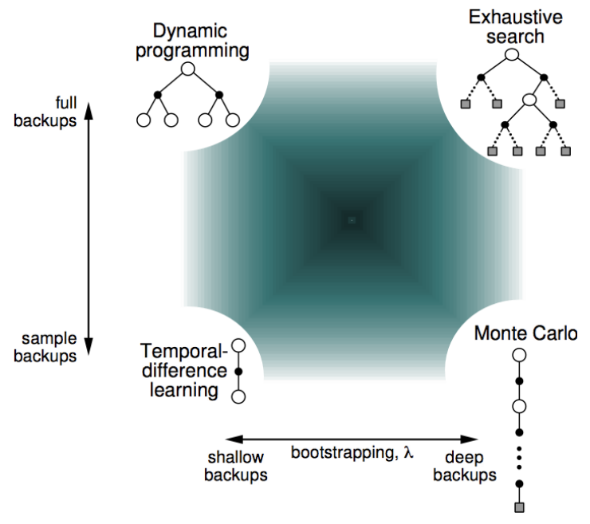
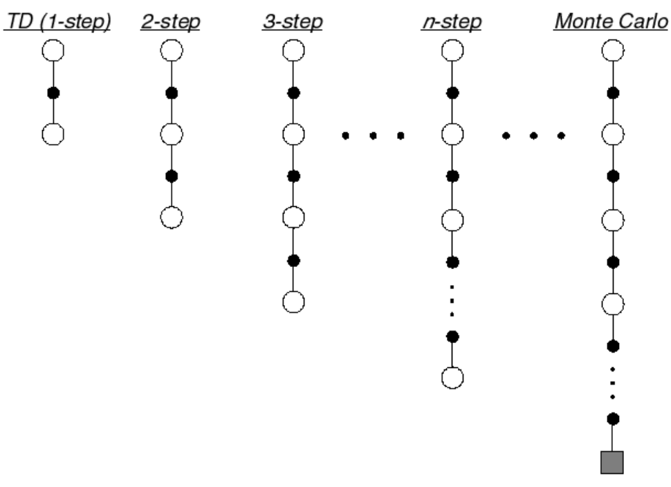
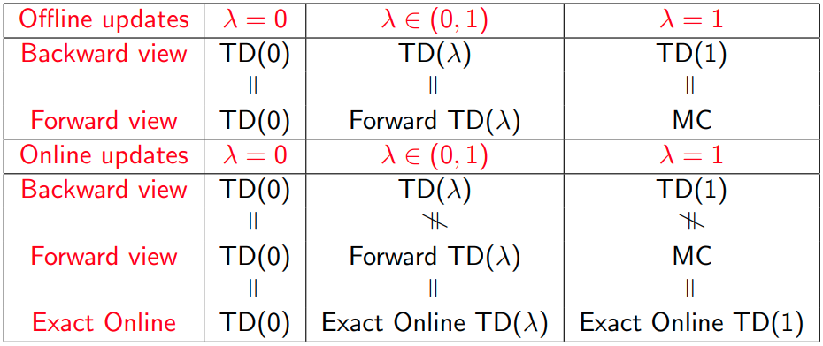

# Lecture 4 · Model-free prediction

These are the notes taken during the RL Course by David Silver.

[TOC]

## Introduction

In the last lecture we worked assuming that we knew a model of the environment. Now we will not assume this. In this lecture we aim to predict the value of a given policy if we don't know how the environment works.

## Monte-Carlo learning

These methods learn directly from experience.

We use complete episodes to learn. A caveat is that all episodes must terminate.

MC assumes that value = mean return. We replace the expectations by the mean.

### First-visit Monte-Carlo policy evaluation

To evaluate state $s$, at the __first__ time-step that $s$ is visited in an episode:

* We increment the counter $N(s)$
* We increment the total return $S(s) \leftarrow S(s) + G_t$
* We can now compute the mean return $V(s) = S(s)/N(s)$

By the law of large numbers, $V(s)$ approaches the true value function as $N(s) \rightarrow \infty$.

### Every-visit Monte-Carlo policy evaluation

In this case, we consider every visit to state $s$ to estimate the value. All the other ideas and steps are the same.

In this way, we could increment the counter several times in the same episode.

### Incremental Monte-Carlo updates

__Incremental mean__: The mean can be computed incrementally: $\mu_k = \mu_{k-1} + \frac{1}{k}(x_k - \mu_{k-1})$. This result can be easily obtained by separating $\mu_k$ into two parts.

We can incrementally update the mean in a MC learning scenario in a similar way:
$$
\begin{align}
	N(S_t) &\leftarrow N(S_t)+1 \\
	V(S_t) &\leftarrow V(S_t) + \frac{1}{N(S_t)}(G_t-V(S_t))
\end{align}
$$
In non-stationary problems, we can track a running mean to forget old episodes: $V(S_t) \leftarrow V(S_t) + \alpha(G_t-V(S_t))$.

## Temporal Difference learning

TD methods learn from actual experience, like MC methods.

The difference is that TD can learn from incomplete episodes, by bootstrapping.

__Bootstrapping__: making a guess towards a guess.

## MC and TD learning

If we take the incremental Monte-Carlo update equation: $V(S_t) \leftarrow V(S_t) + \alpha(G_t-V(S_t))$,

And then replace the average return by the estimated return $R_{t+1} + \gamma V(S_{t+1})$, also called the TD target

We obtain TD(0): $V(S_t) \leftarrow V(S_t) + \alpha(R_{t+1} + \gamma V(S_{t+1})-V(S_t))$

$\delta_t = R_{t+1} + \gamma V(S_{t+1})-V(S_t)$ is called the TD error

## Advantages and disadvantages

* TD can learn before seeing the final outcome. MC must wait until the end of the episode.
* TD can learn in situations when you don't see the final outcome. MC doesn't apply here.

### Bias-variance trade-off

The return $G_t$ is unbiased estimate of $v_\pi(S_t)$

The true TD target $R_{t+1} + \gamma v_\pi(S_{t+1})$ is unbiased estimate of $v_\pi(S_t)$

TD target $R_{t+1} + \gamma V(S_{t+1})$ is biased estimate of $v_\pi(S_t)$

However, TD target is much lower variance than the return, because the return depends on many random actions, rewards... whereas the TD target depends only on one random action, reward...

* __MC__ has high variance, zero bias
    * good convergence
    * not sensitive to initial value
* __TD__ has low variance, some bias
    * usually more efficient than MC
    * not always converges with function approximation
    * more sensitive to initial value

### Batch MC and TD

What if the experience was finite? Do these algorithms converge given a finite batch of experience?

#### Certainty equivalence

* __MC__ converges to solution with minimum mean-squared error.
* __TD(0)__ converges to solution of max likelihood Markov model: the solution to the MDP that best fits the data.

### Markov property

* __TD__ exploits the Markov property, therefore being more efficient in Markov environments
* __MC__ doesn't exploit Markov property, usually more effective in non-Markov environments

### Bootstrapping and sampling

Several _techniques_ to estimate the value fucntion:

* __Bootstrapping__: update involves an estimate
    * MC doesn't bootstrap
    * TD bootstraps
    * DP bootstraps
* __Sampling__: update uses an expectation
    * MC samples
    * TD samples
    * DP doesn't sample

## TD($\lambda$)

The choice of the algorithm is not either TD or MC. There is in fact a family of algorithms that lie between these two cases, and contain both TD(0) and MC as specific cases.

We can obtain this using n-step returns.

Define the n-step return:
$$
G_t^{(n)}=R_{t+1} + \gamma R_{t+2} + \cdots + \gamma^{n-1} R_{t+n} + \gamma^n V(S_{t+n})
$$
n-step temporal-difference learning:
$$
V(S_t) \leftarrow V(S_t) + \alpha \left( G_t^{(n)} - V(S_t) \right)
$$
__Averaging n-step returns__: We can average n-step returns with different n (e.g. average 2-step and 4-step returns)

### $\lambda$-return

TD($\lambda$) combines all n-step returns by weighting them
$$
G_t^\lambda = (1-\lambda) \sum_{n=1}^\infty \lambda^{n-1} G_t^{(n)}
$$
Update:
$$
V(S_t) \leftarrow V(S_t) + \alpha \left( G_t^\lambda - V(S_t) \right)
$$
This is called forward TD($\lambda$), because of the looking forward towards the future.

### Eligibility trace

An eligibility trace combines both the frequency heuristic and recency heuristic (that say that an event must occur based on the times we've seen something or the recency of us seeing that)
$$
\begin{align}
E_0(s)&=0 \\
E_t(s) &= \gamma \lambda E_{t-1}(s) + \mathbf{1}(S_t=s)
\end{align}
$$

### Backward view TD($\lambda$)

* We keep an eligibility trace for every state
* We update the value for every state
* Every update is performed in proportion to TD-error and eligibility trace:

$$
\begin{align}
\delta_t &= R_{t+1} + \gamma V(S_{t+1}) - V(S_t) \\
V(s) &\leftarrow V(s) + \alpha \delta_t E_t(s)
\end{align}
$$

When $\lambda = 0$, we only update the current state: equivalent to TD(0)

> __Theorem:__
>
> The sum of offline updates is identical for forward and backward-view TD($\lambda$)
>
> The equality can be proved $\forall \lambda$.

This result has been extended to online updates as well.

