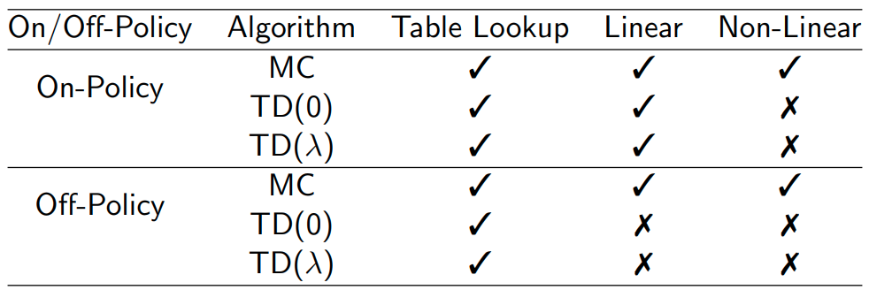

# Lecture 6 · Value function approximation

These are the notes taken during the RL Course by David Silver.

[TOC]

## Introduction

We want to apply RL to real problems. This means that these problems are usually large, they have a huge number of states. We cannot maintain lookup tables for such large problems: both because they are too big to store and because it is slow to learn each value individually.

__Solution:__ estimating the value functions by using function approximation.

### Which function approximator?

There's a lot of possible function approximators. In RL we tend to use differentiable function approximators.

In this lecture we will be focusing on Linear combinations of features and Neural networks.

We need a training method that is suitable for __non-stationary__, __non-iid__ data, because this is the data we will deal with (as opposed to supervised learning).

## Incremental methods

### Gradient descent

In the lecture some background on gradient descent and SGD is given, which is not summarised here.

The main takeaway is that we will use SGD to optimise these function approximators based on the samples we get and their mean squared error compared to the expected value.

### Feature vectors

Usually we represent the state $S$ by a feature vector $\mathbf{x}(S)$, which is a collection of features from the state.

### Linear value function approximation

We can represent the value function by a linear combination of features: $\hat v(S, \mathbf{w}) = \mathbf{x}(S)^T \mathbf{w}$.

Using this, the objective function is quadratic in parameters $\mathbf{w}$. We will converge on a global optimum.

The update rule becomes very simple as: $\Delta \mathbf{w} = \alpha (v_\pi(S)- \hat v(S, \mathbf{w}))\mathbf{x}(S)$.

Table lookup is a special case of linear function approximation where we use a particular feature vector:
$$
\mathbf{x}^{table}(S) = \left(
\begin{matrix}
\mathbf{1}(S=s_1) \\
\vdots \\
\mathbf{1}(S=s_n)
\end{matrix}
\right)
$$

### Incremental prediction

We do not know $v_\pi(s)$ in practice.

In practice, we substitute a target for $v_\pi(s)$.

* For __MC__, the target is the return $G_t$.
* For __TD(0)__, the target is the TD target $R_{t+1} + \gamma \hat v(S_{t+1}, \mathbf w)$.
* For __TD(λ)__, the target is the $\lambda$-return $G_t^\lambda$.

And then we update the function approximator using the gradient descent update formula:
$$
\Delta \mathbf{w} = \alpha (v_\pi(S)- \hat v(S, \mathbf{w}))\nabla_\mathbf{w} \hat v(S_t, \mathbf{w})
$$
Substituting $v_\pi(s)$ by the target of each method.

__MC__ converges to a local optimum, as it's an unbiased sample.

__TD__ converges (close) to a local optimum.

### Incremental control

The ingredients we will now use to perform control are:

* approximate policy evaluation
* $\epsilon$-greedy policy improvement

We want to minimise the MSE between approx action-value fn and true action-value fn.

Using SGD:
$$
\Delta \mathbf{w} = \alpha (q_\pi(S,A)- \hat q(S,A, \mathbf{w}))\nabla_\mathbf{w} \hat q(S,A, \mathbf{w})
$$
Like in prediction, we need to substitute a target for $q_\pi(S,A)$:

* For __MC__, the target is the return $G_t$.
* For __TD(0)__, the target is the TD target $R_{t+1} + \gamma \hat q(S_{t+1},A_{t+1}, \mathbf w)$.
* For __TD(λ)__, the target is the action-value $\lambda$-return $q_t^\lambda$.

### Convergence of Prediction Algorithms

We have to be careful when using TD because in some cases it may not work.

### Convergence of Control Algorithms

## Batch methods

Gradient descent is simple, But it is not sample efficient.

Batch methods seek to find the best fitting value function to all of our data.

### Least squares prediction

We have an experience $D$ and want to find the parameters that minimise the sum-squared error:
$$
LS(\mathbf{w}) = \sum_{t=1}^T (v_t^\pi - \hat v(s_t, \mathbf w))^2
$$

### Stochastic Gradient Descent (with experience replay)

It turns out that by repeatedly sampling state, value pairs from experience and running gradient descent on the samples we eventually arrive to the optimum. This works like any supervised learning problem.

#### Experience Replay in Deep Q-Networks (DQN)

DQN uses __experience replay__ and __fixed Q-targets__. These 2 tricks make the method stable.

The way in which it works is:

* Take action $a_t$ according to $\epsilon$-greedy policy
* Store transition $(s_t, a_t,r_{t+1},s_{t+1})$ in replay memory $D$
* Sample random mini-batch of transitions $(s, a,r,s')$ from $D$
* Compute Q-learning targets w.r.t. old, fixed parameters $w^−$
* Optimise MSE between Q-network and Q-learning targets

### Linear least squares prediction

We can solve the least squares solution directly if we are using a linear function approximation.

At minimum of $LS(\mathbf w)$, the expected update must be zero:

For a small number of features, this is reasonable, because the cost does not depend on the number of states but on the length of the feature vector. (Cost of matrix inversion: $O(N^3)$, or $O(N^2)$ using special tricks)

This approach can be used with MC, TD and TD($\lambda$): LSMC, LSTD, LSTD($\lambda$).

### Least squares control

#### Least squares policy iteration

* __Policy evaluation__: Policy evaluation by least squares Q-learning
* __Policy improvement__: Greedy policy improvement