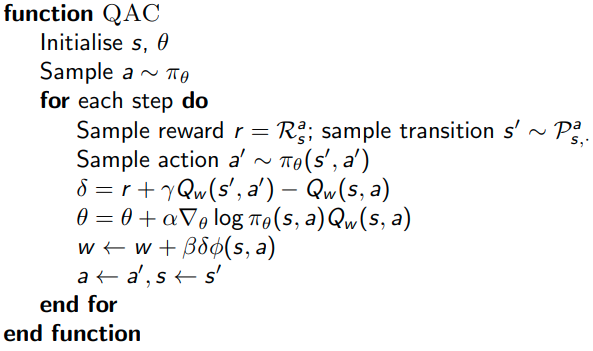

# Lecture 7 · Policy Gradient Methods

These are the notes taken during the RL Course by David Silver.

[TOC]

## Introduction

In the last lecture we approximated the value or action-value function using parameters $\theta$: $Q_\theta(s,a) \simeq Q^\pi(s,a)$. And then the policy was created from the value function.

In this lecture we will parametrise the policy: $\pi_\theta (s,a) = \Pr[a|s, \theta]$.

### Advantages of using Policy-Based RL

* It has better convergence properties
* Effective in high-dimensional or continuous action spaces
* Can learn stochastic policies (consider examples such as rock-paper-scissors)

But

* Typically converge to a local rather than global optimum
* Evaluating a policy is typically inefficient and high variance

### Policy objective functions

We want to have a measure of the quality of a policy $\pi_\theta$.

* **Start value**: $J_1(\theta)=V^{\pi_\theta}(s_1)=\mathbb E_{\pi_\theta}[v_1]$. (Episodic environments)
* **Average value**: $J_{avV}(\theta)=\sum_s d^{\pi_\theta}(s)V^{\pi_\theta}(s)$. (Continuing environments)
* **Average reward per timestep**: $J_{avR} (\theta) = \sum_s d^{\pi_\theta}(s) \sum_a \pi_\theta(s,a)R_s^a$.

Where $d^{\pi_\theta}(s)$ is a stationary distribution of Markov chain for the policy.

They end up following similar gradient directions, so we need not preoccupy with our choice of objective function.

### Policy optimisation

We will focus on gradient methods, because they are usually more efficient than gradient-free ones.

## Finite Difference Policy Gradient

Let $J(\theta)$ be any policy objective function, 

Policy gradient algorithms search for a local maximum in $J(\theta)$ by ascending the gradient of the policy, w.r.t. parameters $\theta$
$$
\Delta \theta = \alpha \nabla_\theta J(\theta)
$$

### Computing gradients By Finite Differences

Used to evaluate the policy gradient.

* For each dimension k
    * Estimate kth partial derivative of objective function w.r.t. $\theta$
    * By perturbing $\theta$ by small amount $\epsilon$ in kth dimension: $\frac{\part J(\theta)}{\part \theta_k} \simeq \frac{J(\theta + \epsilon u_k)-J(\theta)}{\epsilon}$, where $u_k$ is unit vector in direction k.

Simple, noisy, inefficient - but sometimes effective

## Monte-Carlo policy gradient

### Score function

We will compute the gradient analytically

We rewrite the gradient of the policy using likelihood ratios:
$$
\nabla_\theta \pi_\theta(s,a) = \pi_\theta(s,a) \frac{\nabla_\theta \pi_\theta(s,a)}{\pi_\theta(s,a)} = \pi_\theta(s,a) \nabla_\theta \log \pi_\theta(s,a)
$$
$\nabla_\theta \log \pi_\theta(s,a)$ is called the __score function__. This function appears when maximising the log-likelihood.

### Policy Gradient Theorem

The policy gradient theorem generalises the likelihood ratio approach to multi-step MDPs.

> __Theorem:__
>
> For any differentiable policy $\pi_\theta(s, a)$,
> for any of the policy objective functions $J = J_1$, $J_{avR}$, or $\frac{1}{1−\gamma} J_{avV}$ ,
> the policy gradient is:
> $$
> \nabla_\theta J(\theta) = \mathbb E_{\pi_\theta} [\nabla_\theta \log \pi_\theta(s,a) Q^{\pi_\theta}(s,a)]
> $$

### Monte-Carlo policy gradient (REINFORCE)

Update the parameters using SGD.

Using return $v_t$ as an unbiased sample of $Q^{\pi_\theta}(s,a)$.
$$
\Rightarrow \Delta \theta_t=\alpha \nabla_\theta \log \pi_\theta(s_t,a_t) v_t
$$

## Actor-Critic methods

Instead of using the return to estimate the action-value function, we will use a **critic** to estimate it: $Q_w(s,a) \simeq Q^{\pi_\theta}(s,a)$.

Actor-critic algorithms maintain __two__ sets of __parameters__:

* __Critic__: Updates action-value function parameters $w$
* __Actor__: Updates policy parameters $\theta$, in direction suggested by critic

Now, the _approximate_ policy gradient is:
$$
\begin{align}
	\nabla_\theta J(\theta) &\simeq \mathbb E_{\pi_\theta} [\nabla_\theta \log \pi_\theta(s,a) Q_w(s,a)] \\
	\Delta \theta &=\alpha \nabla_\theta \log \pi_\theta(s_t,a_t) Q_w(s,a)
\end{align}
$$

### Estimating the Action-Value Function

We can use any of the policy evaluation techniques from the previous lectures.

### Action-Value Actor-Critic (QAC)

Simple actor-critic algorithm based on action-value critic.

We use linear function approximation. We will update the critic by linear TD(0).

### Reducing variance using a Baseline

We subtract a baseline function $B(s)$ from the policy gradient. This function must have zero mean (be a state but not action function). This can reduce variance, without changing expectation.

If we choose the state value function as the baseline, we can define the __advantage function__: $A^{\pi_\theta}(s,a)=Q^{\pi_\theta}(s,a) - V^{\pi_\theta}(s)$.

The usage of the advantage function can significantly __reduce the variance__ of the policy gradient.

#### Estimating the advantage function

The critic should really estimate the advantage function.

One way to do so is by estimating both $V^{\pi_\theta}(s)$ and $Q^{\pi_\theta}(s,a)$. we can do this by using two function approximators and two parameter vectors. And then updating both value functions by e.g. TD learning.

A __better way__ is to understand the TD error as a sample of the advantage function.

Taking the true value function, the TD error is: $\delta^{\pi_\theta}=r + \gamma V^{\pi_\theta}(s') - V^{\pi_\theta}(s)$. Then,

The expected TD error is an unbiased estimate of the advantage function.

We can use the TD error to compute the policy gradient.

In practice, we normally use an approximate TD error with only a single set of critic parameters $v$:
$$
\delta_v=r+\gamma V_v(s') - V_v(s)
$$

### Actors at different time-scales

When dealing with critics, we could estimate the value function from many targets (return, TD target, $\lambda$-return, eligibility traces).

We want to do the same with actors. Updating the parameters we can use several approximations of $Q^{\pi_\theta}$.

Just like in forward-view TD($\lambda$), we can mix over time-scales using $v_t^\lambda-V_v(s_t)$ as an estimate of $Q^{\pi_\theta}$.

Like backward-view TD($\lambda$), we can also use __eligibility traces__:

### Compatible function approximation

> __Theorem:__
>
> If the following two conditions are satisfied:
>
> 1. Value function approximator is __compatible__ to the policy:
>     $$
>     \nabla_w Q_w(s,a)=\nabla_\theta \log \pi_\theta(s,a)
>     $$
>
> 2. Value function parameters w minimise the mean-squared error
>     $$
>     \epsilon=\mathbb E_{\pi_\theta}[(Q^{\pi_\theta}(s,a) - Q_w(s,a))^2]
>     $$
>
> Then the policy gradient is __exact__.

(Proof in the slides)

### Natural actor-critic

Alternative descent/ascent direction which has interesting properties. More information about it in the lecture notes. 