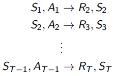
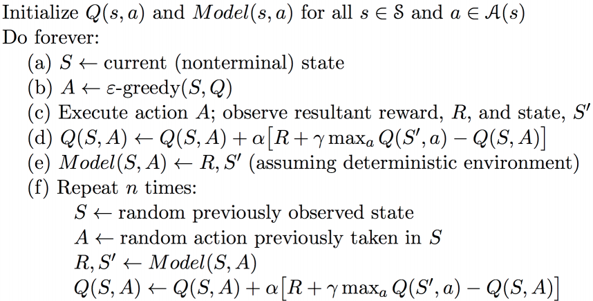

# Lecture 8 · Integrating learning and planning

These are the notes taken during the RL Course by David Silver.

[TOC]

## Introduction

In this lecture, instead of learning the policy or the value function, we aim to __learn the model__ from experience.

Then we will be able to plan with this model to construct a value function or policy.

### Difference between model-free and model-based

In Model-Free RL, we learn a value function (and/or policy) from experience.

In Model-Based RL, instead, we learn a model from experience and __plan__ value function (and/or policy) __from model__.

## Model-Based RL

The underlying idea is to get a better model with experience and get better rewards as a consequence of planning in a more accurate model.

### Advantages of MB RL

* Can __efficiently learn model__ by supervised learning methods
* Can reason about model __uncertainty__

But:

* First learn a model, then construct a value function: __two sources__ of approximation __error__

### A model

A model $M$ is fundamentally a representation of an MDP ($\left<S,A,P,R \right>$), parametrized by $\eta$.

We assume $S$ and $A$ are known.

A model has to model state transitions and rewards:
$$
\begin{align}
	S_{t+1} &\sim P_\eta(S_{t+1}|S_t, A_t) \\
	R_{t+1} &= R_\eta(R_{t+1}|S_t, A_t)
\end{align}
$$
We typically assume conditional independence between state transitions and rewards.

### Model learning

If we have an experience $\{S_1,A_1,R_2, \cdots, S_T\}$, we can turn model learning into a supervised learning problem.

Learning the reward is a __regression__ problem.

Learning the state transitions is a __density estimation__ problem.

#### Table lookup model

The most basic model, we store every state action pair in a table and count the visits to each pair.

__Alternatively__, at each time-step t, record experience tuple. To sample model, randomly pick tuple matching.

### Planning with a model

Given a model, we can solve the MDP using any planning algorithm.

#### Sample-based planning

Use the model only to generate samples.

Then apply model-free RL to samples (MC, Sarsa, Q-learning...).

These methods are often more efficient, as interacting with the true environment is usually expensive (simulators, robots...).

#### Planning with an inaccurate model

Given an imperfect model, the performance is limited to the optimal policy in the approximate MDP.

> Model-based RL is only as good as the estimated model

__Solutions__: using model-free RL, reasoning about the uncertainty.

## Integrated architectures

### Real and Simulated Experience

We now have two sources of experience:

* __Real experience__: Sampled from environment (true MDP)
* __Simulated experience__: Sampled from model (approximate MDP)

### Dyna

Instead of using only the simulated experience to plan the value function.

Learn and plan value function from both real and simulated experience (all the available experience).

#### Dyna-Q algorithm

Here is the pseudo-code for a simple version of this algorithm.

This algorithm has been found to work very well in practice, when taking a few _imagined_ steps is far better than learning only from real experience.

## Simulation-based search

### Forward search

Forward search algorithms select the best action by lookahead.

They build a search tree with the current state $s_t$ at the root.

Therefore, there is __no need to solve the whole MDP__, but the sub-MDP starting from $s_t$.

### Simulation-based search

Forward search paradigm using sample-based planning.

__Simulate episodes__ of experience __from now__ with the model. Then __learn__ from the __imagined experience__.

Applying model-free RL algorithms to the simulated experience we obtain a search algorithm (MC control $\rightarrow$ MC search...)

### MC search

#### Simple MC search

Given a model and a simulation policy $\pi$.

For each action $a \in A$:

* Simulate K episodes from current (real) state $s_t$ from the model and $\pi$.
* Evaluate actions by mean return (Monte-Carlo evaluation): $Q(s_t,a)=\frac{1}K \sum_{k=1}^K G_t \rightarrow q_\pi(s_t,a)$

Select current (real) action with maximum value: $a_t = \textrm{argmax}_{a\in A} Q(s_t,a)$.

#### MC tree search

##### Evaluation

Given a model $M_\nu$

Simulate K episodes from current state $s_t$ using current simulation policy $\pi$.

Build a search tree containing visited states and actions.

Evaluate states $Q(s, a)$ by mean return of episodes from $s, a$ (every state action pair in the tree below $s_t$).

After search is finished, select current (real) action with maximum value in search tree.

##### Simulation

In MCTS, the simulation policy $\pi$ improves.

Each simulation consists of two phases:

* Tree policy (improves): pick actions to maximise $Q(S, A)$
* Default policy (fixed): pick actions randomly

Repeat (each simulation):

* Evaluate states $Q(S, A)$ by Monte-Carlo evaluation
* Improve tree policy, e.g. by $\epsilon$-greedy($Q$)

This algorithm is the same as Monte-Carlo control applied to simulated experience

Converges on the optimal search tree.

#### Application to Go

The interesting application of these methods to the game of Go is explained in the lecture.

### TD search

In the same way that we have applied MC to sub-MDP, we want to use TD and bootstrap.

TD search applies Sarsa to sub-MDP from now.

We've seen TD learning to reduce variance, it is usually more efficient than MC. The same applies to simulation-based search.

The __main idea__ here is:

Simulate episodes from the current (real) state $s_t$

Estimate action-value function $Q(s, a)$

For each step of simulation, update action-values by Sarsa

Select actions based on action-values $Q(s, a)$

#### Dyna-2

The agent stores __two sets of feature weights__: long-term and short-term memory.

__Long-term__ memory is updated from __real experience__ using TD learning. __General__ domain knowledge that applies to any episode.

__Short-term__ memory is updated from __simulated experience__ using TD search. __Specific__ local knowledge about the current situation.

Over value function is __sum__ of long and short-term memories.