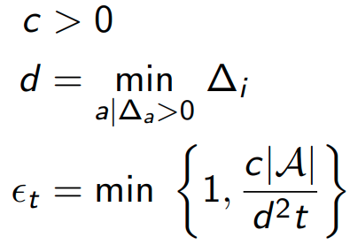

# Lecture 9 · Exploration and exploitation

These are the notes taken during the RL Course by David Silver.

[TOC]

## Introduction

### Exploration vs exploitation

Online decision-making involves a fundamental choice:

* __Exploitation__: Make the best decision given current information
* __Exploration__: Gather more information

The best long-term strategy may involve short-term sacrifices.

### Approaches to exploration

* __Random exploration__: Explore random actions ($\epsilon$-greedy)
* __Optimism in the Face of Uncertainty__: Prefer actions with uncertain values
* __Information State Search__: To consider an agent's information as part of its state. Lookahead search incorporating value of information.

## Multi-armed bandits

### The Multi-Armed Bandit

A multi-armed bandit is a set of actions that we can take, with the respective rewards that we get. There is no states.

The goal is to maximise cumulative reward.

### Regret

The __regret__ is the opportunity loss for one step:
$$
l_t=\mathbb E [v_* - q(A_t)]
$$
The __total regret__ is the total opportunity loss:
$$
L_t=\mathbb E \left[\sum_{\tau=1}^t (v_* - q(A_\tau))\right]
$$
Maximise cumulative reward is the same as to minimise total regret

#### Counting Regret

The count $N_t(a)$ is expected number of selections for action $a$

The gap $\Delta_a$ is the difference in value between action $a$ and optimal action $a^*$, $\Delta_a = v_*-q(a)$.

We can write the regret as $L_t=\sum_{a\in A} \mathbb E[N_t(a)]\Delta_a$

Gaps are not known

#### Sublinear regret

If an algorithm __forever__ explores ($\epsilon$-greedy) it will have linear total regret

If an algorithm __never__ explores (greedy) it will also have linear total regret

We __want__ to achieve __sublinear total regret__.

### Random exploration

#### Greedy algorithm

We consider algorithms that estimate $Q_t(a) \simeq q(a)$

Estimate the value of each action by Monte-Carlo evaluation

The greedy algorithm selects action with highest value (locking onto a suboptimal action forever)

As a consequence, __Greedy__ has __linear total regret__.

##### Optimistic Initialisation

Initialise $Q(a)$ to high value (maximum possible reward)

Then act greedily

Encourages systematic exploration early on

But a few unlucky samples can also lock out optimal action

As a consequence, __optimistic greedy__ has __linear total regret__.

#### $\epsilon$-greedy algorithm

This algorithm continues to explore forever

* Act greedily with probability $1-\epsilon$
* Select random action with probability $\epsilon$

It still has linear total regret (although small)

##### Decaying $\epsilon_t$-greedy algorithm

We pick a decay schedule for $\epsilon_t$

A possible schedule is suggested in the notes:

Decaying $\epsilon_t$-greedy has logarithmic asymptotic total regret!

But schedule requires advance knowledge of gaps

__Goal__: find an __algorithm__ with __sublinear__ regret for any multi-armed bandit (__without__ knowledge of $R$)

#### Lower bound

The __performance__ of any algorithm is determined by __similarity__ between optimal arm and other arms

__Hard problems__ have __similar-looking arms__ with different means

> __Theorem (Lai and Robbins):__
>
> Asymptotic total regret is at least logarithmic in number of steps:
> $$
> \lim_{t\rightarrow \infty} L_t \geq \log t \sum_{a|\Delta_a > 0}\frac{\Delta_a}{KL(R^a||R^{a^*})}
> $$

### Optimism in the face of uncertainty

The __more uncertain__ we are about an action-value, the __more important__ it is to explore that action

#### Upper confidence bounds

They are basically a __high probability confidence interval__ of where the __reward__ could possibly be.

Estimate $U_t(a)$, such that $q(a) \leq Q_t(a)+U_t(a)$

* Small $N_t(a)$, large $U_t(a)$ (estimated value is uncertain)
* Large $N_t(a)$, small $U_t(a)$ (estimated value is accurate)

Select __action maximising UCB__: $a_t= \textrm{argmax}_{a\in A} Q_t(a) + U_t(a)$

#### Hoeffding’s Inequality

> __Theorem (Hoeffding’s Inequality):__
>
> Let $X_1, \cdots, X_t$ be i.i.d. random variables in $[0,1]$, and let $X_t =\frac{1}{\tau}\sum_{\tau=1}^t X_t$ be the sample mean. Then
> $$
> \Pr\left[ \mathbb E[X] > \bar X_t + u \right] \leq e^{-2tu^2}
> $$

We will apply Hoeffding’s Inequality to rewards of the bandit conditioned on selecting action $a$:
$$
\Pr\left[ q(a) > Q_t(a) + U_t(a) \right] \leq e^{-2N_t(a)U_t(a)^2}
$$
Solving for $U_t(a)$:
$$
U_t(a)=\sqrt{\frac{-\log p}{2N_t(a)}}
$$
Reduce p as we observe more rewards ($p=t^{-4}$):
$$
U_t(a)=\sqrt{\frac{2\log t}{N_t(a)}}
$$

#### UCB1

This leads to the UCB1 algorithm:
$$
a_t = \textrm{argmax}_{a\in A} Q(a) +\sqrt{\frac{2\log t}{N_t(a)}}
$$

> __Theorem:__
>
> The UCB algorithm achieves logarithmic asymptotic total regret
> $$
> \lim_{t\rightarrow \infty}L_t \leq 8\log t \sum_{a|\Delta_a>0}\Delta_a
> $$

#### Bayesian Bandits

Bayesian bandits exploit __prior knowledge__ of rewards

Consider a distribution $p[Q|\mathbf w]$

Bayesian methods compute posterior distribution over $\mathbf w$: $p[\mathbf w|R_1, \cdots, R_t]$, which we use to guide exploration.

Estimate upper confidence from posterior, e.g. $U_t(a)=c\sigma(a)$

Then pick action that maximises $Q_t(a) + c\sigma(a)$

#### Probability matching

Probability matching selects action $a$ according to probability that $a$ is the optimal action
$$
\pi(a)=\Pr\left[Q(a) > Q(a'), \forall a' \neq a|R_1, \cdots, R_{t-1} \right]
$$
Probability matching is optimistic in the face of uncertainty, as uncertain actions have higher probability of being max.

##### Thompson sampling

$$
\pi(a)=\mathbb E[\mathbf 1(Q(a)=\max_a' Q(a'))|R_1, \cdots, R_{t-1}]
$$

* Use Bayes law to compute posterior distribution
* Sample an action-value function from posterior
* Select action maximising sample, $A_t=\textrm{argmax}_{a\in A}Q(a)$
* Thompson sampling achieves Lai and Robbins lower bound (for Bernoulli bandits)

### Information state space

The decisions are taken based on the __value of information__.

The bandit problem is no longer a one-step problem, as we recover an MDP in the augmented information state space.

#### Bernoulli bandits

Consider a Bernoulli bandit $B(\mu_a)$

Want to find which arm has the highest $\mu_a$ (probability of winning)

The information state is $\tilde s=\left<\alpha, \beta \right>$, where:

* $\alpha_a$ counts the pulls of arm $a$ where reward was 0
* $\beta_a$ counts the pulls of arm $a$ where reward was 1

#### Solving Information State Space Bandits

This new MDP can be solved by reinforcement learning (either Model-free or Bayes-adaptive RL)

Bayesian model-based reinforcement learning finds Bayes-optimal exploration/exploitation trade-off with respect to prior distribution

##### Bayes-Adaptive Bernoulli Bandits

Start with $Beta(\alpha_a, \beta_a)$ prior over reward function $R$

Each time $a$ is selected, update posterior for $R^a$:

* $Beta(\alpha_a + 1, \beta_a)$ if $r=0$
* $Beta(\alpha_a , \beta_a+1)$ if $r=1$

This defines __transition__ function for the Bayes-adaptive MDP

Each state transition corresponds to a Bayesian model update

The optimal solution is known as the __Gittins index__ (typically intractable)

Recent approaches include __applying MC tree search__ to this large state space

## Contextual bandits

We introduce __states__ back.

We're shown a state (context) and we have to pick an action, then get a reward.

In the lecture slides there is further material on this contextual bandit approach, along with examples of practical applications shown to perform well.

## MDPs

### UCB for MDPs

The UCB approach can be generalised to MDPs

We aim to maximise UCB on action-value function:
$$
A_t=\textrm{argmax}_{a\in A} Q(S_t,a) + U(S_t,a)
$$
This approach ignores uncertainty from policy improvement

### Optimistic initialisation in model-based RL

Construct a model of the MDP

For unknown or poorly estimated states, set reward function to $r_\max$ (very optimistic in the face of uncertainty)

Then solve with planning algorithms, which will try to reach these well-regarded states and discover their actual rewards.

E.g. Rmax algorithm

### Information State Search in MDPs

MDPs can be augmented to include information state

Now the augmented state is $\tilde S=\left<S, I \right>$, where $I$ is the information gathered

This extended MDP becomes increasingly large, but can be solved using approximation and sample-based methods, e.g. MC tree search has been proven effective in some cases.

### More information

More information about exploration-exploitation in MDPs can be found in the lecture notes.

